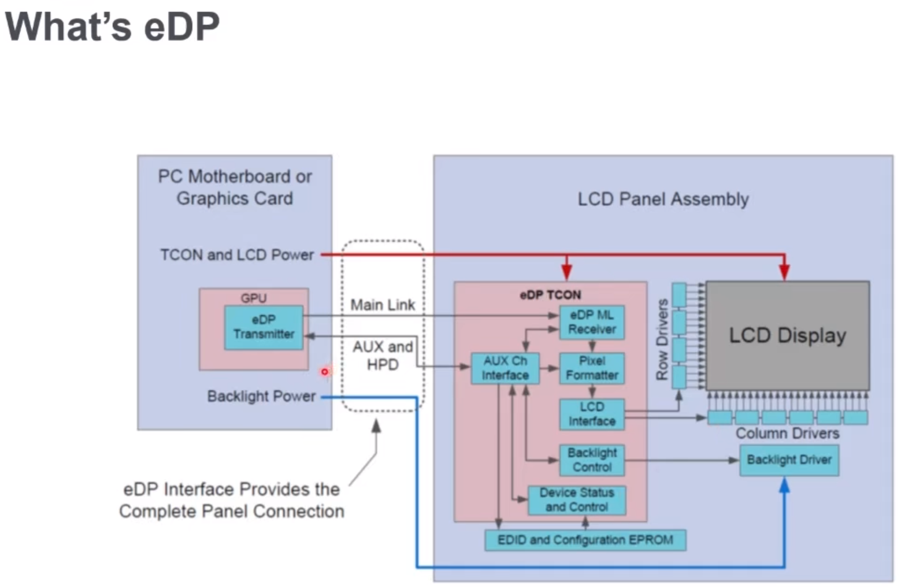

# 用Typora写邮件可以吗

## 第一主题：插入文字

普通文字,单行文字

> 引用内容  
> An awesome project. 
> + 无序1
> + 无序2

*斜体*

1. 第一项
2. 第二项
3. 第三项

无序编号，注意上上面的区别

* 无序编号1
* 无序编号2

- [ ] 代办事项
- [x] 代办2

**加粗**

~~删除~~

***

分割线

***

```python
a = list(1,3,4)
with open(r'filename.txt') as fd:
   data_user=pd.read_csv(fd)  #文件的读操作

with open('data.txt', 'w') as fw:
   fw.write('Hello world')  #文件的写操作
```
```
相关参数说明：
r:    以只读方式打开文件。文件的指针将会放在文件的开头。这是**默认模式**。
rb: 以二进制格式打开一个文件用于只读。文件指针将会放在文件的开头。这是默认模式。
r+: 打开一个文件用于读写。文件指针将会放在文件的开头。
rb+:以二进制格式打开一个文件用于读写。文件指针将会放在文件的开头。
w:    打开一个文件只用于写入。如果该文件已存在则将其覆盖。如果该文件不存在，创建新文件。
wb:    以二进制格式打开一个文件只用于写入。如果该文件已存在则将其覆盖。如果该文件不存在，创建新文件。
w+:    打开一个文件用于读写。如果该文件已存在则将其覆盖。如果该文件不存在，创建新文件。
wb+:以二进制格式打开一个文件用于读写。如果该文件已存在则将其覆盖。如果该文件不存在，创建新文件。
a:    打开一个文件用于追加。如果该文件已存在，文件指针将会放在文件的结尾。也就是说，新的内容将会被写入到已有内容之后。如果该文件不存在，创建新文件进行写入。
ab:    以二进制格式打开一个文件用于追加。如果该文件已存在，文件指针将会放在文件的结尾。也就是说，新的内容将会被写入到已有内容之后。如果该文件不存在，创建新文件进行写入。
a+:    打开一个文件用于读写。如果该文件已存在，文件指针将会放在文件的结尾。文件打开时会是追加模式。如果该文件不存在，创建新文件用于读写。
ab+:以二进制格式打开一个文件用于追加。如果该文件已存在，文件指针将会放在文件的结尾。如果该文件不存在，创建新文件用于读写。

file对象的属性：
file.read([size])   将文件数据作为字符串返回，可选参数size控制读取的字节数
file.readlines([size])   返回文件中行内容的列表，size参数可选
file.write(str)   将字符串写入文件
file.writelines(strings)   将字符串序列写入文件
file.close()   关闭文件
file.closed    表示文件已经被关闭，否则为False

file.mode    Access文件打开时使用的访问模式
file.encoding    文件所使用的编码
file.name    文件名
file.newlines    未读取到行分隔符时为None，只有一种行分隔符时为一个字符串，当文件有多种类型的行结束符时，则为一个包含所有当前所遇到的行结束的列表
file.softspace    为0表示在输出一数据后，要加上一个空格符，1表示不加。这个属性一般程序员用不着，由程序内部使用
```

## 第二主题：插入图片

截图一张插入截图**效果**




